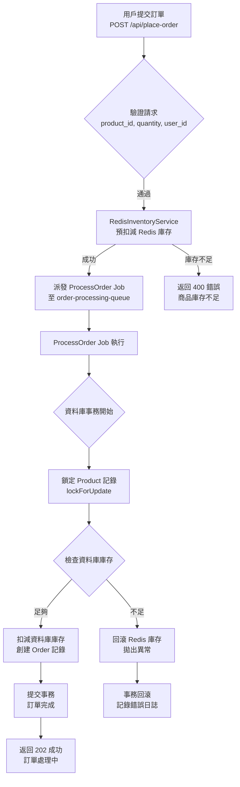

# Anti-Overselling Demo

這是一個基於 Laravel 的高併發防超賣展示專案，利用 Laravel、Redis 和 Queue 技術實現高效的庫存管理和訂單處理。專案由資深 PHP 工程師設計，旨在展示在電商高流量場景下解決超賣問題的企業級解決方案。

## 專案特色
- **高併發處理**：通過 Redis 實現庫存預扣減，結合 Laravel Queue 進行異步訂單處理，有效防止超賣。
- **穩健架構**：採用服務層、任務分派和資料庫事務，確保程式碼可維護性和資料一致性。
- **API 文件**：集成 Swagger 提供清晰的 API 文件，便於團隊協作和前端對接。
- **全面測試**：包含單元測試和功能測試，覆蓋關鍵業務邏輯，確保程式碼質量。
- **生產就緒**：配置 CI/CD 就緒的 `composer.json` 和 `.env.example`，展示企業級開發實踐。

## 技術棧
- **PHP 8.2**，**Laravel 11**
- **Redis**：用於庫存鎖定和快速存取
- **MySQL**：持久化資料儲存
- **Laravel Queue**：異步任務處理
- **Swagger**：API 文件生成
- **PHPUnit**：單元與功能測試

## 訂單處理流程圖
以下是訂單處理的流程圖，使用 Mermaid 語法繪製，展示 Redis 庫存預扣減、Queue 異步處理和資料庫事務的邏輯：



**說明**：
- 用戶提交訂單後，系統先驗證請求參數。
- RedisInventoryService 預扣減 Redis 庫存，若成功則派發異步 Job。
- ProcessOrder Job 在資料庫事務中檢查並扣減資料庫庫存，確保資料一致性。
- 若庫存不足，Redis 庫存回滾，防止超賣。

## 安裝說明
1. 克隆儲存庫：
   ```bash
   git clone https://github.com/BpsEason/anti-overselling-demo.git
   cd anti-overselling-demo
   ```
2. 安裝依賴：
   ```bash
   composer install
   ```
3. 配置環境：
   ```bash
   cp .env.example .env
   ```
   在 `.env` 中更新 MySQL 和 Redis 連線資訊，例如：
   ```env
   DB_CONNECTION=mysql
   DB_HOST=127.0.0.1
   DB_PORT=3306
   DB_DATABASE=laravel_anti_overselling
   DB_USERNAME=root
   DB_PASSWORD=your_password

   REDIS_HOST=127.0.0.1
   REDIS_PORT=6379
   REDIS_INVENTORY_DB=1
   ```
4. 生成應用金鑰：
   ```bash
   php artisan key:generate
   ```
5. 執行資料庫遷移：
   ```bash
   php artisan migrate
   ```
6. 啟動 Queue 工作進程：
   ```bash
   php artisan queue:work --queue=order-processing-queue
   ```
7. 啟動應用：
   ```bash
   php artisan serve
   ```
8. 生成 Swagger API 文件：
   ```bash
   php artisan vendor:publish --provider="L5Swagger\L5SwaggerServiceProvider"
   php artisan l5-swagger:generate
   ```
   訪問 `http://localhost:8000/api/documentation` 查看 API 文件。

## API 端點
| 方法 | 端點                          | 描述                     |
|------|-------------------------------|--------------------------|
| POST | `/api/place-order`            | 提交訂單，包含商品 ID、數量和用戶 ID |
| POST | `/api/init-stock`             | 初始化商品和 Redis 庫存   |
| GET  | `/api/get-redis-stock/{productId}` | 查詢 Redis 庫存         |
| GET  | `/api/get-db-stock/{productId}`   | 查詢資料庫庫存          |

**範例請求**（`POST /api/place-order`）：
```json
{
    "product_id": 1,
    "quantity": 2,
    "user_id": 101
}
```

**範例回應**：
```json
{
    "message": "訂單已提交，正在處理中。",
    "order_identifier": "a1b2c3d4-e5f6-7890-1234-567890abcdef"
}
```

## 測試
執行測試以驗證系統可靠性：
```bash
php artisan test
```
測試覆蓋：
- Redis 庫存操作（預扣減、回滾）
- 訂單處理邏輯（資料庫事務、Job 執行）
- API 端點（請求驗證、錯誤處理）

## 為什麼開發這個專案？
作為一名資深 PHP 工程師，我開發此專案以展示：
- **可擴展性**：通過 Redis 和 Queue 應對高併發搶購場景。
- **程式碼質量**：遵循 PSR-12 和 SOLID 原則，結構清晰。
- **資料完整性**：使用資料庫事務和回滾機制確保庫存一致性。
- **協作能力**：提供詳細的安裝說明、流程圖和 API 文件，方便團隊合作。

## 貢獻
歡迎提交 Issue 或 Pull Request！請先閱讀 [CONTRIBUTING.md](CONTRIBUTING.md)（可自行創建）。

## 授權
[MIT License](LICENSE)