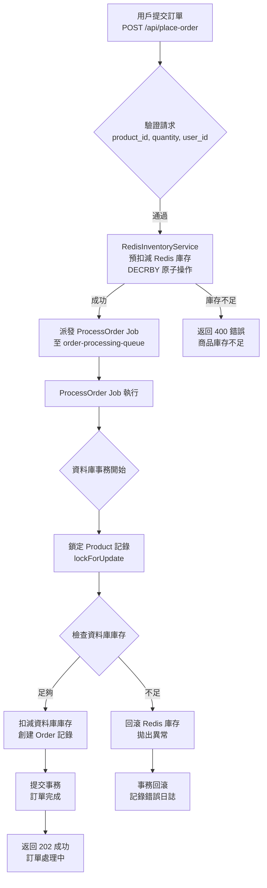

# Anti-Overselling Demo

這是一個基於 Laravel 的高併發防超賣展示專案，利用 Laravel、Redis 和 Queue 技術實現高效的庫存管理和訂單處理。專案旨在展示如何在電商高流量場景下解決超賣問題，提供企業級的技術解決方案。

## 專案特色
- **高併發處理**：利用 Redis 原子操作實現庫存預扣減，結合 Laravel Queue 異步處理，防止超賣並提升 API 響應速度。
- **穩健架構**：採用服務層（`RedisInventoryService`）、隊列任務（`ProcessOrder`）和資料庫事務，確保程式碼結構清晰且資料一致。
- **API 文件**：集成 Swagger 提供交互式 API 文件，方便團隊協作和前端對接。
- **全面測試**：包含單元測試（`RedisInventoryServiceTest`）和功能測試（`OrderApiTest`），覆蓋關鍵業務邏輯。
- **生產就緒**：配置 CI/CD 就緒的 `composer.json` 和 `.env.example`，遵循 PSR-12 規範。

## 技術棧
- **PHP 8.2**，**Laravel 11**
- **Redis**：用於庫存鎖定和快速存取
- **MySQL**：持久化資料儲存
- **Laravel Queue**：異步任務處理
- **Swagger**：API 文件生成
- **PHPUnit**：單元與功能測試

## 訂單處理流程圖
以下是訂單處理流程圖，使用 Mermaid 語法繪製，展示 Redis 庫存預扣減、Queue 異步處理和資料庫事務的邏輯：



**說明**：
- **Redis 預扣減**：使用 `DECRBY` 原子操作快速過濾無效請求，減輕資料庫壓力。
- **Queue 異步處理**：將資料庫寫入卸載至 `ProcessOrder` Job，提升 API 響應速度。
- **雙重檢查**：資料庫層使用 `lockForUpdate` 確保最終庫存一致性，防止超賣。
- **錯誤回滾**：若 Job 失敗，`failed()` 方法回滾 Redis 庫存，保證數據完整性。

## 技術深入
以下是專案設計中的關鍵技術決策，解釋了為什麼採用這些方案：

| 問題 | 回答 |
|------|------|
| **為什麼選擇 Redis 進行庫存管理？** | Redis 提供內存級速度和原子操作（如 `DECRBY`），適合高併發庫存扣減。作為快速「守門員」，它減少資料庫負載，防止競爭條件。使用 `REDIS_INVENTORY_DB=1` 確保數據分離。 |
| **為什麼使用 Laravel Queue？** | Queue 解耦 API 請求與資料庫寫入，提升響應速度（`202 Accepted`）。支持重試（`$tries=3`）和失敗處理（`failed()` 方法回滾 Redis 庫存），增強可靠性。 |
| **為什麼需要 Redis 和資料庫雙重檢查？** | Redis 是快速緩存，但資料庫是真相來源。`lockForUpdate` 鎖定商品記錄，防止併發 Job 導致超賣，確保最終一致性。 |
| **如何處理 Redis 或 Queue 故障？** | Redis 故障時，API 返回 500 錯誤，可回退至資料庫操作。Queue 工作進程停機時，Job 積累於 Redis 隊列，恢復後自動處理。需監控隊列長度和 Redis 狀態。 |
| **如何擴展系統？** | 水平擴展 Web 伺服器（Nginx/PHP-FPM）、Redis Cluster、Queue 工作進程（Horizon）。資料庫可採用讀寫分離或分片，優化查詢索引。 |

**主要挑戰與解決方案**：
- **競爭條件**：通過 Redis `DECRBY` 和 MySQL `lockForUpdate` 防止併發超賣。
- **數據一致性**：回滾機制（`rollbackStock`）和資料庫事務確保 Redis 與資料庫同步。
- **高負載響應**：Queue 異步處理和 Redis 快速存取保證 API 性能。

## 安裝說明
1. 克隆儲存庫：
   ```bash
   git clone https://github.com/BpsEason/anti-overselling-demo.git
   cd anti-overselling-demo
   ```
2. 安裝依賴：
   ```bash
   composer install
   ```
3. 配置環境：
   ```bash
   cp .env.example .env
   ```
   更新 `.env` 中的 MySQL 和 Redis 連線資訊，例如：
   ```env
   DB_CONNECTION=mysql
   DB_HOST=127.0.0.1
   DB_PORT=3306
   DB_DATABASE=laravel_anti_overselling
   DB_USERNAME=root
   DB_PASSWORD=your_password

   REDIS_HOST=127.0.0.1
   REDIS_PORT=6379
   REDIS_INVENTORY_DB=1
   ```
4. 生成應用金鑰：
   ```bash
   php artisan key:generate
   ```
5. 執行資料庫遷移：
   ```bash
   php artisan migrate
   ```
6. 啟動 Queue 工作進程：
   ```bash
   php artisan queue:work --queue=order-processing-queue
   ```
7. 啟動應用：
   ```bash
   php artisan serve
   ```
8. 生成 Swagger API 文件：
   ```bash
   php artisan vendor:publish --provider="L5Swagger\L5SwaggerServiceProvider"
   php artisan l5-swagger:generate
   ```
   訪問 `http://localhost:8000/api/documentation` 查看 API 文件。

## API 端點
| 方法 | 端點                          | 描述                     |
|------|-------------------------------|--------------------------|
| POST | `/api/place-order`            | 提交訂單，包含商品 ID、數量和用戶 ID |
| POST | `/api/init-stock`             | 初始化商品和 Redis 庫存   |
| GET  | `/api/get-redis-stock/{productId}` | 查詢 Redis 庫存         |
| GET  | `/api/get-db-stock/{productId}`   | 查詢資料庫庫存          |

**範例請求**（`POST /api/place-order`）：
```json
{
    "product_id": 1,
    "quantity": 2,
    "user_id": 101
}
```

**範例回應**：
```json
{
    "message": "訂單已提交，正在處理中。",
    "order_identifier": "a1b2c3d4-e5f6-7890-1234-567890abcdef"
}
```

## 測試
執行測試以驗證系統可靠性：
```bash
php artisan test
```
測試覆蓋：
- Redis 庫存操作（`RedisInventoryServiceTest`）
- 訂單處理邏輯（`ProcessOrderTest`）
- API 端點（`OrderApiTest`）

## 專案目標
本專案旨在展示：
- **高併發解決方案**：應對電商搶購場景的技術實現。
- **程式碼規範**：遵循 PSR-12 和 SOLID 原則，結構清晰。
- **資料一致性**：多層防護確保庫存無誤。
- **團隊協作**：提供流程圖、Swagger 文件和安裝說明，便於理解與使用。

## 貢獻
歡迎提交 Issue 或 Pull Request！請先閱讀 [CONTRIBUTING.md](CONTRIBUTING.md)（可自行創建）。

## 授權
[MIT License](LICENSE)