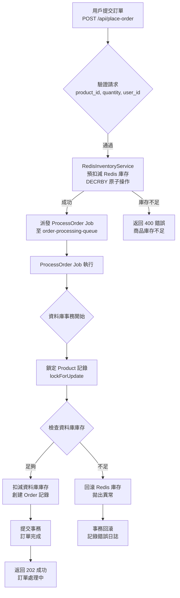

# 高併發防超賣展示專案

這是一個基於 Laravel 的高併發防超賣展示專案，利用 Laravel、Redis 和 Queue 技術實現高效的庫存管理和訂單處理。專案旨在展示如何在電商高流量場景下解決超賣問題，提供穩健且可擴展的技術解決方案。

## 專案特色
- **高併發處理**：利用 Redis 原子操作實現庫存預扣減，結合 Laravel Queue 異步處理，防止超賣並提升 API 響應速度。
- **穩健架構**：採用服務層（`RedisInventoryService`）、隊列任務（`ProcessOrder`）和資料庫事務，確保程式碼結構清晰且資料一致。
- **API 文件**：集成 Swagger 提供交互式 API 文件，方便團隊協作和前端對接。
- **全面測試**：包含單元測試（`RedisInventoryServiceTest`）和功能測試（`OrderApiTest`），覆蓋關鍵業務邏輯。
- **生產就緒**：配置 CI/CD 就緒的 `composer.json` 和 `.env.example`，遵循 PSR-12 規範。

## 技術棧
- **PHP 8.2**，**Laravel 11**
- **Redis**：用於庫存鎖定和快速存取
- **MySQL**：持久化資料儲存
- **Laravel Queue**：異步任務處理
- **Swagger**：API 文件生成
- **PHPUnit**：單元與功能測試

## 訂單處理流程圖
以下是訂單處理流程圖，使用 Mermaid 語法繪製，展示 Redis 庫存預扣減、Queue 異步處理和資料庫事務的邏輯：



**說明**：
- **Redis 預扣減**：使用 `DECRBY` 原子操作快速過濾無效請求，減輕資料庫壓力。
- **Queue 異步處理**：將資料庫寫入卸載至 `ProcessOrder` Job，提升 API 響應速度。
- **雙重檢查**：資料庫層使用 `lockForUpdate` 確保最終庫存一致性，防止超賣。
- **錯誤回滾**：若 Job 失敗，`failed()` 方法回滾 Redis 庫存，保證數據完整性。

## 關鍵代碼展示

以下是專案中核心部分的代碼片段，包含詳細的中文註解，展示如何實現高併發防超賣。

### 1. RedisInventoryService - 庫存管理服務
這是負責 Redis 庫存操作的核心服務類，使用原子操作來確保併發安全。

```php
<?php

namespace App\Services;

use Illuminate\Support\Facades\Redis;
use Illuminate\Support\Facades\Log;

class RedisInventoryService
{
    protected $redis;
    protected $prefix = 'product:stock:';

    // 構造函數，初始化 Redis 連接
    public function __construct()
    {
        $this->redis = Redis::connection('inventory'); // 使用配置中的 inventory 連接
    }

    // 初始化 Redis 庫存
    public function initStock(int $productId, int $stock): void
    {
        $this->redis->set($this->prefix . $productId, $stock); // 設置商品的初始庫存
        Log::info("Redis stock for product {$productId} initialized to {$stock}.");
    }

    // 獲取當前 Redis 庫存
    public function getStock(int $productId): int
    {
        return (int) $this->redis->get($this->prefix . $productId); // 返回整數型庫存值
    }

    // 預扣減 Redis 庫存，使用原子操作
    public function preDecrementStock(int $productId, int $quantity): bool
    {
        $newStock = $this->redis->decrby($this->prefix . $productId, $quantity); // 原子扣減庫存

        if ($newStock < 0) { // 若扣減後庫存為負，則回滾
            $this->redis->incrby($this->prefix . $productId, $quantity); // 回補庫存
            Log::warning("Redis pre-decrement failed for product {$productId}: insufficient stock.");
            return false;
        }

        Log::info("Redis pre-decrement successful for product {$productId}: deducted {$quantity}.");
        return true;
    }

    // 回滾 Redis 庫存，用於錯誤處理
    public function rollbackStock(int $productId, int $quantity): void
    {
        $this->redis->incrby($this->prefix . $productId, $quantity); // 增加庫存
        Log::info("Redis stock rolled back for product {$productId}: added {$quantity}.");
    }
}
```

**註解說明**：
- 使用 `DECRBY` 進行原子扣減，防止併發競爭。
- 若庫存不足（`newStock < 0`），立即回滾並記錄日誌。
- `prefix` 確保 Redis 鍵的命名空間清晰，避免衝突。

### 2. ProcessOrder Job - 異步訂單處理
這是負責異步處理訂單的隊列任務，確保資料庫操作不會阻塞 API 響應。

```php
<?php

namespace App\Jobs;

use App\Models\Order;
use App\Models\Product;
use App\Services\RedisInventoryService;
use Illuminate\Bus\Queueable;
use Illuminate\Contracts\Queue\ShouldQueue;
use Illuminate\Foundation\Bus\Dispatchable;
use Illuminate\Queue\InteractsWithQueue;
use Illuminate\Queue\SerializesModels;
use Illuminate\Support\Facades\DB;
use Illuminate\Support\Facades\Log;

class ProcessOrder implements ShouldQueue
{
    use Dispatchable, InteractsWithQueue, Queueable, SerializesModels;

    public $tries = 3; // 最大重試次數
    public $timeout = 60; // 任務超時時間（秒）

    protected $productId;
    protected $quantity;
    protected $userId;
    protected $preOrderIdentifier;

    // 構造函數，初始化任務參數
    public function __construct(int $productId, int $quantity, int $userId, ?string $preOrderIdentifier = null)
    {
        $this->productId = $productId;
        $this->quantity = $quantity;
        $this->userId = $userId;
        $this->preOrderIdentifier = $preOrderIdentifier;
        $this->onQueue(env('REDIS_QUEUE', 'order-processing-queue')); // 指定隊列
    }

    // 執行任務邏輯
    public function handle(RedisInventoryService $redisInventoryService): void
    {
        Log::info("Processing order job started for ProductID: {$this->productId}");

        try {
            DB::transaction(function () use ($redisInventoryService) { // 開啟資料庫事務
                $product = Product::lockForUpdate()->find($this->productId); // 鎖定商品記錄

                if (!$product) {
                    Log::error("Product ID: {$this->productId} not found.");
                    throw new \Exception("Product not found.");
                }

                if ($product->stock < $this->quantity) { // 檢查資料庫庫存
                    Log::warning("DB stock mismatch for product {$this->productId}.");
                    $redisInventoryService->rollbackStock($this->productId, $this->quantity); // 回滾 Redis
                    throw new \Exception("Insufficient database stock.");
                }

                $product->stock -= $this->quantity; // 扣減資料庫庫存
                $product->save();

                Order::create([ // 創建訂單記錄
                    'product_id' => $this->productId,
                    'quantity' => $this->quantity,
                    'user_id' => $this->userId,
                    'status' => 'completed',
                ]);

                Log::info("Order successfully processed for ProductID: {$this->productId}.");
            });
        } catch (\Exception $e) {
            Log::error("Order processing failed: " . $e->getMessage());
            throw $e; // 重新拋出異常，讓隊列處理重試或失敗邏輯
        }
    }

    // 任務失敗時的處理邏輯
    public function failed(\Throwable $exception)
    {
        Log::critical("ProcessOrder Job failed: " . $exception->getMessage());
        $redisInventoryService = app(RedisInventoryService::class);
        $redisInventoryService->rollbackStock($this->productId, $this->quantity); // 回滾 Redis 庫存
        Log::info("Redis stock rolled back on Job failure for product {$this->productId}.");
    }
}
```

**註解說明**：
- 使用 `lockForUpdate` 鎖定資料庫記錄，防止併發修改。
- 事務確保資料庫操作的原子性，若失敗則自動回滾。
- `failed` 方法處理任務永久失敗的情況，確保 Redis 庫存回滾。

### 3. OrderController - API 控制器
負責處理用戶提交的訂單請求，並調度隊列任務。

```php
<?php

namespace App\Http\Controllers;

use App\Services\RedisInventoryService;
use App\Jobs\ProcessOrder;
use Illuminate\Http\Request;
use Illuminate\Support\Facades\Log;

class OrderApiController extends Controller
{
    protected $redisInventoryService;

 public function __construct(RedisInventoryService $redisInventoryService)
    {
        $this->redisInventoryService = $redisInventoryService;
;
    }

    public function placeOrder(Request $request)
    {
        // 驗證請求參數
        $request->validate([
            'product_id' => 'required|integer|exists:products,id',
            'quantity' => 'required|integer|min:1',
            'user_id' => 'required|integer',
        ]);

        $productId = $request->input('product_id');
        $quantity = $request->input('quantity');
        $userId = $request->input('user_id');

        $preOrderIdentifier = Str::uuid()->toString(); // 生成唯一訂單標識符

        Log::info("Received order request for ProductID: {$productId}");

        try {
            // 嘗試預扣減 Redis 庫存
            $preDeducted = $this->redisInventory->Service->preDecrementStock($productId, $quantity);

            if (!$preDeducted) {
                Log::warning("Redis pre-deduction failed for product {$productId}.");
                return response()->json([
                    'message' => '商品庫存不足，請稍後再試。'
                ], 400);
            }

            // 派發訂單處理任務至隊列
            ProcessOrder::dispatch($productId, $quantity, $userId, $preOrderIdentifier);

            Log::info("Job dispatched for ProductID: {$productId}.");

            // 返回 202 狀態，表示請求已接受
            return response()->json([
                'message' => '訂單已提交，正在處理中。',
                'order_identifier' => $preOrderIdentifier
            ], 202);

        } catch (\Exception $e) {
            // 若發生異常，回滾 Redis 庫存
            if (isset($preDeducted) && $preDeducted) {
                $this->redisInventory->Service->rollback($productId, $quantity);
                Log::warning("API error after Redis pre-deduction, rolling back stock.");
            }

            Log::error("Order request failed: " . $e->getMessage()); // 記錄錯誤

            return response()->json([
                ' => '訂單處理異常，請稍後再試。'
            ], 500);
        }
    }
}
```

**註解說明**：
- 使用 Laravel 的驗證器確保請求參數有效。
- 通過 `202 Accepted` 響應提升用戶體驗，實際處理交由隊列完成。
- 異常處理確保 Redis 庫存回滾，避免數據不一致。

## 安裝說明
1. 克隆儲存庫：
   ```bash
   git clone https://github.com/BpsEason/anti-overselling-demo.git
   cd anti-overselling-demo
   ```
2. 安裝依賴：
   ```bash
   composer install
   ```
3. 配置環境：
   ```bash
   cp .env.example .env
   ```
   更新 `.env` 中的 MySQL 和 Redis 連線資訊，例如：
   ```env
   myenv
   DB_CONNECTION=mysql
   DB_HOST=127.0.0.1
   DB_PORT=3306
   DB_DATABASE=laravel_anti_overselling
   DB_USERNAME=root
   DB_PASSWORD=your_password

   REDIS_HOST=127.0.0.1
   REDIS_PORT=6379
   REDIS_INVENTORY_DB=1
   ```
4. 生成應用金鑰：
   ```bash
   php artisan key:generate
   ```
5. 執行資料庫遷移：
   ```bash
   php artisan migrate
   ```
6. 啟動 Queue 工作進程：
   ```bash
   php artisan queue:work --queue=order-processing-queue
   ```
7. 啟動應用：
   ```bash
   php artisan serve
   ```
8. 生成 Swagger API 文件：
   ```bash
   php artisan vendor:publish --provider="L5Swagger\L5SwaggerServiceProvider"
   php artisan l5-swagger:generate
   ```
   訪問 `http://localhost:8000/api/documentation` 查看 API 文件。

## API 端點
| 方法 | 端點                          | 描述                     |
|------|-------------------------------|--------------------------|
| POST | `/api/place-order`            | 提交訂單，包含商品 ID、數量和用戶 ID |
| POST | `/api/init-stock`             | 初始化商品和 Redis 庫存   |
| GET  | `/api/get-redis-stock/{productId}` | 查詢 Redis 庫存         |
| GET   | `/api/get-db-stock/{productId}`   | 查詢資料庫庫存          |

**範例請求**（`POST /api/place-order`）：
```json
{
    "product_id": 1,
    "quantity": 2,
    "user_id": 101
}
```

**範例回應**：
```json
{
    "message": "訂單已提交，正在處理中。",
    "order_identifier": "a1b2c3d4-e5f6-7890-1234-567890abcdef"
}
```

## 測試
執行程式碼測試以驗證系統可靠性：
```bash
php artisan test
```
測試覆蓋：
- Redis 庫存操作（`RedisInventoryServiceTest`）
- 訂單處理邏輯（`ProcessOrderTest`）
- API 端點（`OrderApiTest`）

## 性能估計
在單台中低配伺服器（4 核心 8GB RAM，4 個 Queue 工作進程）下，系統估計每分鐘可處理 **1200-4800 次請求**（20-80 QPS）。若商品集中搶購，QPS 偏低；若商品分散，QPS 可接近上限。

## 專案目標
本專案旨在展示：
- **高併發解決方案**：應對電商搶購場景的技術實現。
- **程式碼規範**：遵循 PSR-12 和 SOLID 原則，結構清晰。
- **資料一致性**：多層防護確保庫存無誤。
- **團隊協作**：提供流程圖、Swagger 文件和詳細安裝說明，便於理解與使用。

## 授權
[MIT License](LICENSE)
